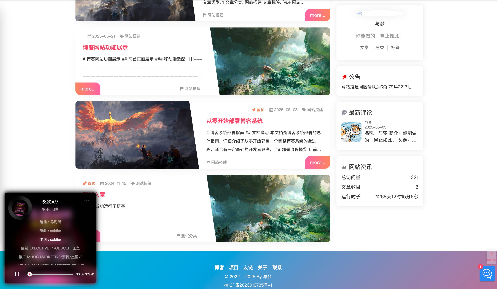
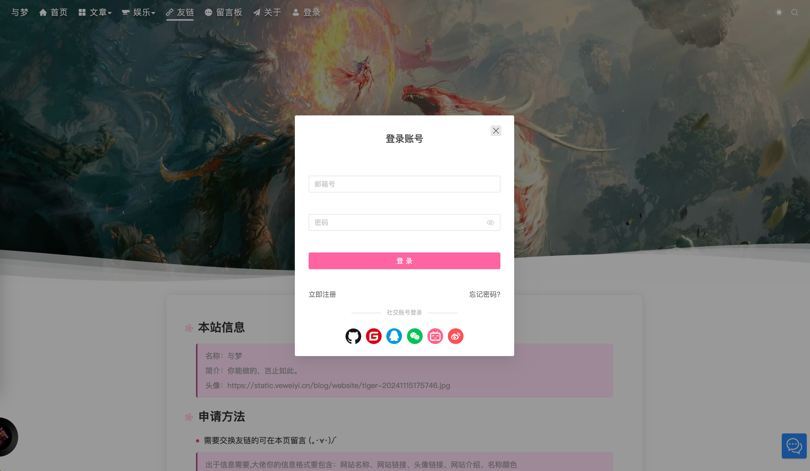
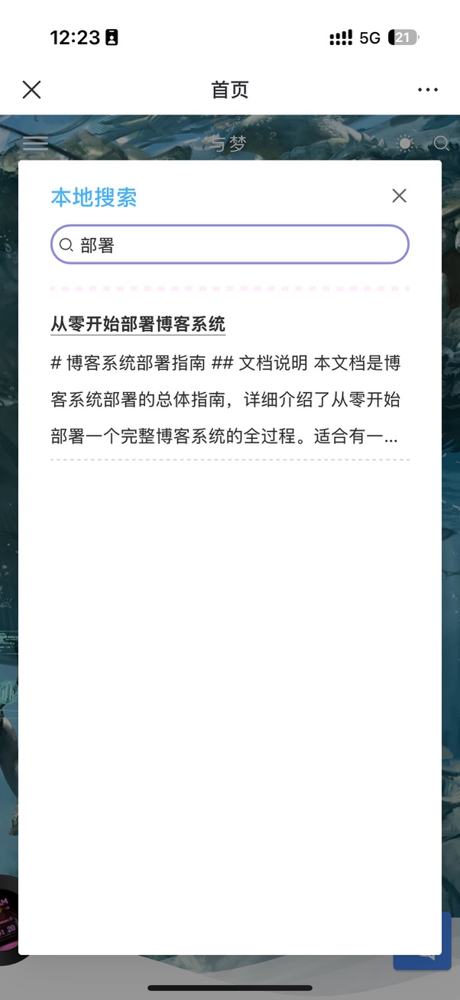

<div align="center">
  
  <h1>ve-blog-naive</h1>
  <p>🎨 基于 Vue 3 + Naive UI 的现代化博客前台</p>

  
  
  
  
  
  
  
</div>


<div align="center">

  <a target="_blank" href="https://blog.veweiyi.cn">
    
  </a>
  <br/>
  <a target="_blank" href="https://blog.veweiyi.cn/api/v1/swagger/index.html">📑 接口文档</a>
</div>

<br/>

## 📚 项目简介

ve-blog-naive 是 ve-blog 博客系统的前台展示项目，基于 Vue 3 + TypeScript + Naive UI 构建。提供文章浏览、社交互动、实时聊天、相册、音乐播放等丰富的用户端功能，支持响应式布局和深色/浅色主题切换。

### ✨ 核心亮点

- 🎨 **开箱即用的视觉体验** — Naive UI 组件库 + 精心调教的响应式布局，PC / 平板 / 手机完美适配
- 🌓 **智能主题切换** — 深色 / 浅色一键切换，跟随系统偏好，保护眼睛
- ⚡ **极速首屏** — Vite 6 + UnoCSS 原子化 CSS + 按需加载，首屏秒开
- 💬 **社交功能完备** — WebSocket 实时聊天、留言弹幕、说说动态、音乐播放器，不止是博客
- 🔌 **即插即用的组件体系** — 20+ 通用组件，组件化程度高，二次开发只需关注页面
- 🛠️ **零配置上手** — `pnpm dev` 一行命令启动，Mock 数据内置，前端可独立开发调试

## 📸 项目预览

✨ **博客网站**






📲 **移动端**

|                |                |                |
|----------------|----------------|----------------|
|  |  |  |

## 🛠️ 技术栈

| 技术 | 说明 | 版本 |
|------|------|------|
| Vue 3 | 渐进式框架 | 3.5 |
| TypeScript | 类型安全 | 5.9 |
| Vite | 构建工具 | 6.4 |
| Naive UI | UI 组件库 | 2.43 |
| Pinia | 状态管理 | 3.0 |
| UnoCSS | 原子化 CSS | 66.5 |
| Vue Router | 路由管理 | 4.6 |
| Axios | HTTP 请求 | 1.13 |
| ECharts | 数据可视化 | 5.6 |
| StompJS | WebSocket 客户端 | 7.2 |

## 🎯 页面功能

| 页面 | 功能 | 状态 |
|------|------|:--:|
| 🏠 首页 | 文章列表、轮播 Banner、站点统计 | ✅ |
| ✍️ 文章 | Markdown 渲染、目录导航、代码高亮、评论点赞 | ✅ |
| 📂 分类/标签 | 分类统计、标签云、关联文章 | ✅ |
| 📅 归档 | 时间轴浏览、按年月聚合 | ✅ |
| 💬 说说 | 动态发布、点赞互动、弹幕墙 | ✅ |
| 🖼️ 相册 | 相册列表、照片浏览、懒加载 | ✅ |
| 👥 友链 | 友情链接展示、访问统计 | ✅ |
| 🎵 音乐 | 在线音乐播放器 | ✅ |
| 💬 聊天室 | WebSocket + Stomp 实时聊天 | ✅ |
| 🔐 登录 | OAuth2.0（GitHub / QQ / 微信）| ✅ |
| 🤖 AI 助手 | AI 对话组件 | ✅ |
| 🌓 主题 | 深色/浅色切换、跟随系统 | ✅ |

## 📁 项目源码

| 项目 | 说明 | 仓库 |
|------|------|------|
| ve-blog-golang | 博客后端（go-zero 微服务版） | [GitHub](https://github.com/ve-weiyi/ve-blog-golang) |
| ve-blog-gin | 博客后端（Gin 单体版） | [GitHub](https://github.com/ve-weiyi/ve-blog-gin) |
| ve-blog-naive | 博客前台 | [GitHub](https://github.com/ve-weiyi/ve-blog-naive) |
| ve-admin-element | 博客后台 | [GitHub](https://github.com/ve-weiyi/ve-admin-element) |

## 🏗️ 项目结构

```
ve-blog-naive/
├── src/
│   ├── api/              # API 接口定义
│   ├── assets/           # 静态资源
│   ├── components/       # 20+ 通用组件
│   │   ├── AiAssistant/  # AI 助手
│   │   ├── Catalog/      # 文章目录
│   │   ├── ChatRoom/     # 聊天室
│   │   ├── MusicPlayer/  # 音乐播放器
│   │   └── ...
│   ├── plugins/          # 插件配置
│   ├── router/           # 路由配置
│   ├── store/            # Pinia 状态管理
│   ├── utils/            # 工具函数
│   └── views/            # 页面组件（按功能模块分目录）
├── public/               # 公共静态资源
│   ├── deploy/              # 部署配置
│   │   ├── docker/          # Docker 构建 (Dockerfile + nginx.conf)
│   │   ├── docker-compose/  # Docker Compose 编排
│   │   └── k8s/             # Kubernetes 部署 (预留)
└── vite.config.ts        # Vite 配置
```

## ⚙️ 环境要求

- **Node.js**: >= 20
- **pnpm**: >= 9

## 🚀 快速开始

```bash
# 1. 克隆 & 安装
git clone https://github.com/ve-weiyi/ve-blog-naive.git && cd ve-blog-naive
pnpm install

# 2. 启动开发服务器
pnpm dev                     # → http://localhost:9420
```

## 🐳 Docker 部署

```bash
# Docker 构建 & 运行
docker build -f deploy/docker/Dockerfile -t ve-blog-naive:latest .
docker run -d --name ve-blog-naive --restart always -p 9420:80 ve-blog-naive:latest

# 或使用 Docker Compose
cd deploy/docker-compose && docker compose up -d
```

## 📈 开发路线

### 已完成 ✅
- [x] 文章浏览（列表 / 详情 / 目录导航 / 代码高亮）
- [x] 评论 + 点赞系统
- [x] 分类 / 标签 / 归档 / 搜索
- [x] 相册浏览 + 图片懒加载
- [x] 说说动态 + 弹幕墙
- [x] 友链展示
- [x] WebSocket 实时聊天室（Stomp）
- [x] OAuth2.0 多端登录
- [x] AI 助手组件
- [x] 音乐播放器
- [x] 深色 / 浅色主题切换
- [x] 响应式布局（PC / 平板 / 手机）

### 进行中 🚧
- [ ] 相册详情页性能优化
- [ ] 归档页时间轴重构
- [ ] SEO 优化

### 计划中 📋
- [ ] PWA 离线支持
- [ ] 单元测试 + E2E 测试
- [ ] 国际化（i18n）

## 🤝 参与贡献

1. Fork 本仓库
2. 创建分支：`git checkout -b feature/your-feature`
3. 提交：`git commit -m 'feat: 添加某功能'`
4. 推送：`git push origin feature/your-feature`
5. 提交 Pull Request

提交规范遵循 [Conventional Commits](https://www.conventionalcommits.org/)：
`feat:` / `fix:` / `docs:` / `refactor:` / `style:` / `test:` / `chore:`

## 📄 开源协议

MIT License — 可自由使用、修改和分发。

---

<div align="center">
  <p>如果这个项目对你有帮助，请给个 ⭐ Star 支持一下！</p>
  <p>Made with ❤️ by <a href="https://github.com/ve-weiyi">ve-weiyi</a></p>
</div>
